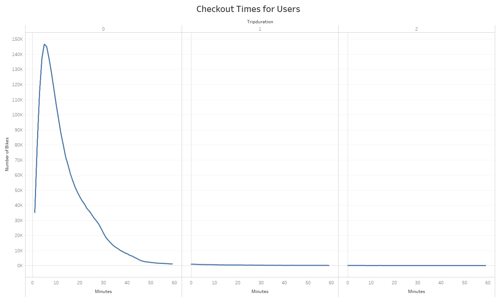
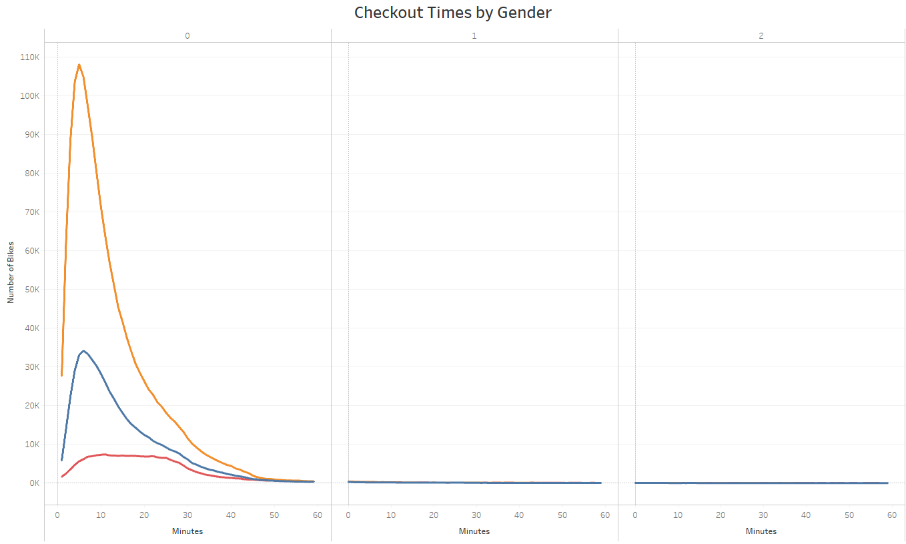
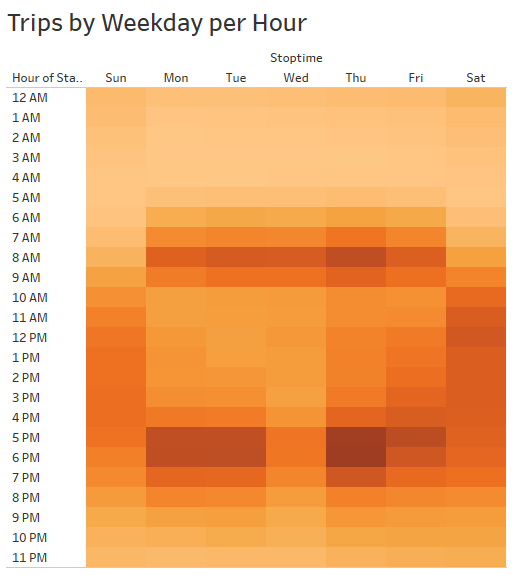
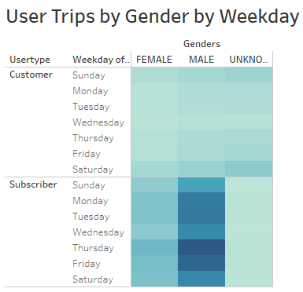
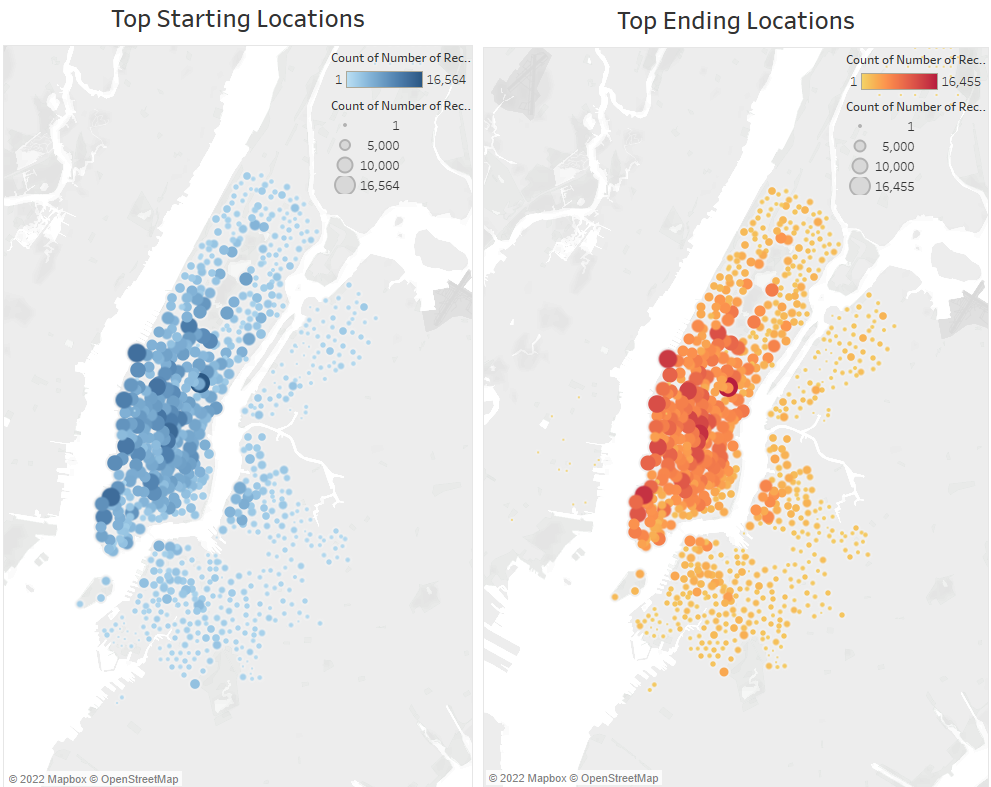

# RBC-Module-14-NY-Citibike-with-Tabelau

## Overview:
In this project we look at the stats of Bike-Share program in NYC and use it to support our ideas for starting a Bike-Share program in `Des Moines`. To achieve this we will use one of the most promising Data Visualization Tools out there, namely `Tableau`.

### Purpose:
The purpose of this project is to help us support our business idea for a Bike-Sharing program in `Des Moines` with the help of Tableau and using its vast array of tools and visualization techniques to generate a multitude of visulations. To do this we are using the `NYC-Citibike` Dataset from `August 2019`.

### Link to Tableau Story:
[Link to Tableau Story](https://public.tableau.com/app/profile/mubeen.ahmed.khan/viz/NYCBikeShareProgram/NYCBikeChallenge) | [Alternative Link](https://public.tableau.com/app/profile/mubeen.ahmed.khan/viz/RBC-Module-14-Tableau-Challenge/NYCBikeShareChallenge)

### Files Used:
* [Bike Dataset](201908-citibike-tripdata.csv) | Original Dataset.
* [Jupyter Notebook Script](NYC_CitiBike_Challenge.ipynb) | For modifying data in the `tripduration` column to `Date-Time`.
* [Bike Revised Dataset](201908-citibike-tripdataREVISED.csv) | After adding another Date-time column using Python & Pandas from the epoch time in `tripduration` column.

### Results
* Here we can see that Bikes can be readily available to customers when needed. Our results show that 49% of the rides were under 10 minutes (1.1 M vs 2.3 M)

* The visulazation here shows us that Males are primarily the users of the bikeshare program. Though there is no gender bias of any kind.

* The third - heatmap shows us that most of the rides that occur during the weekdays are during the commute hours of 8-9 AM and 5-7 PM. Additionally we see high usage during afternoon on weekends.

* The following heatmap shows us the trips by gender for the same. Male riders are more inclined to use the bikeshare program to commute to and from work as well as during the weekends.
.png)

* From the image below we can see that Thusday was the day with the highest usage amongst subscribers while for non-subscribers its Saturday.

* The image below shows us that majority of the riders are subscribers. Therefore, buisness will be primarily targeted at residents rather than tourists.

* Finally from the last image we can see that the Bikes are located in business areas, which have higher usage compared to other locations.

### Summary:
* Most of the usage from our visualizations show that the down-town and mid-town areas make up for the majority of the usage of the service.
* Subscribers are primarily the main users.
* The duration of most trips is under 10 mins.

The program will see fruitition in Des Moines if it is situated in densely populated areas where commuters need it for commuting purposes related to work and possible break-times.

### Additional Visulization Possibilities:
* Review data from other cities that may be a closer match to the population, size and traffic pattern of Des Moines. (Limiting our analysis to activity in New York City is not the correct comparison as New York City has a very large commuter population, as well as higher people traffic from tourism.)
* Create visualization by month for an entire year to identify if weather affected usage.
* Create visualizations which maps out travel distance from start to end points.
* Create visualizations centered towards the usage based on age-groups and then further enhancing it based on gender focus.
